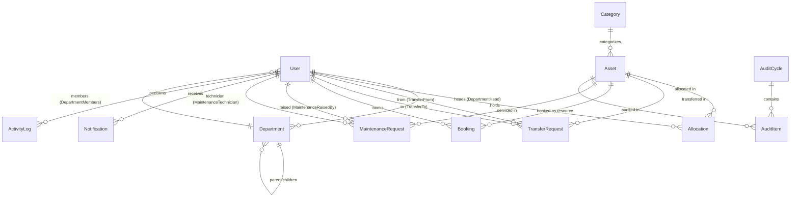

# Data Model

The schema lives in [`server/prisma/schema.prisma`](../server/prisma/schema.prisma) and targets
PostgreSQL. Every model uses a `cuid()` string primary key (`id String @id @default(cuid())`).

## Enums

| Enum | Values |
|------|--------|
| `Role` | `EMPLOYEE`, `DEPT_HEAD`, `ASSET_MANAGER`, `ADMIN` |
| `AssetStatus` | `AVAILABLE`, `ALLOCATED`, `RESERVED`, `UNDER_MAINTENANCE`, `LOST`, `RETIRED`, `DISPOSED` |
| `TransferStatus` | `REQUESTED`, `APPROVED`, `REALLOCATED` |
| `MaintenanceStatus` | `PENDING`, `APPROVED`, `REJECTED`, `TECH_ASSIGNED`, `IN_PROGRESS`, `RESOLVED` |
| `AuditVerdict` | `VERIFIED`, `MISSING`, `DAMAGED` |
| `BookingStatus` | `UPCOMING`, `ONGOING`, `COMPLETED`, `CANCELLED` |

## Entities

### Identity & master data

- **User** — name, unique `email`, `passwordHash`, `role` (defaults to `EMPLOYEE`), optional
  `departmentId`, `status` (defaults to `"ACTIVE"`). A user may head one or more departments and
  belong to one department.
- **Department** — self-referential hierarchy via `parentId` (parent → children) and an optional
  `headId` pointing at the User who heads it. `status` defaults to `"ACTIVE"`.
- **Category** — asset category (Electronics, Furniture, Vehicles, …) with optional
  `customFields` JSON for category-specific attributes (e.g. warranty period).

### Assets

- **Asset** — unique auto-generated `assetTag` (e.g. `AF-0001`), `serialNumber`, `acquisitionDate`,
  `cost`, `condition`, `location`, `status` (`AssetStatus`, defaults `AVAILABLE`), `isBookable`
  flag for shared resources, optional `photoUrl`. Belongs to a Category.

### Allocation & transfer

- **Allocation** — links an Asset to a holding User. `allocatedAt`, optional `expectedReturnDate`,
  optional `returnedAt`, optional `conditionNotes`. **History rule: rows are never deleted — an
  open allocation has `returnedAt = null`.**
- **TransferRequest** — an Asset moving `fromUser` → `toUser`, with `status` (`TransferStatus`,
  defaults `REQUESTED`) and optional `reason`.

### Booking & maintenance

- **Booking** — a time slot (`startTime`, `endTime`) on a bookable Asset (`resource`), booked by a
  User, with `status` (`BookingStatus`, defaults `UPCOMING`). Overlap validation is enforced in the
  booking flow.
- **MaintenanceRequest** — raised by a User against an Asset with a `description`, `priority`, and
  `status` (`MaintenanceStatus`, defaults `PENDING`); an optional `technician` is assigned as the
  request advances.

### Audit

- **AuditCycle** — a verification cycle with `scope`, `startDate`, `endDate`, `status` (defaults
  `"OPEN"`), and `auditorIds` (array of User ids).
- **AuditItem** — one asset within a cycle, carrying an optional `verdict` (`AuditVerdict`).

### Notifications & activity

- **Notification** — per-User typed message with a `read` flag.
- **ActivityLog** — an audit trail row: `userId`, `action`, `entityType`, `entityId`, `createdAt`.

## Relationships

Named relations disambiguate the multiple edges between the same two models:

| Relation name | Between | Meaning |
|---------------|---------|---------|
| `DepartmentMembers` | User ↔ Department | a user's home department |
| `DepartmentHead` | User ↔ Department | the user who heads a department |
| `DepartmentHierarchy` | Department ↔ Department | parent / children |
| `TransferFrom` / `TransferTo` | User ↔ TransferRequest | sender / receiver of a transfer |
| `MaintenanceRaisedBy` / `MaintenanceTechnician` | User ↔ MaintenanceRequest | requester / assigned technician |

## ER diagram

## Asset lifecycle

`AssetStatus` transitions are driven by the surrounding workflows:

- Registration → `AVAILABLE`
- Allocation → `ALLOCATED`; return → `AVAILABLE`
- Maintenance approved → `UNDER_MAINTENANCE`; resolved → `AVAILABLE`
- Bookable resources may be `RESERVED` for a slot
- Audit-confirmed missing → `LOST`; end-of-life → `RETIRED` → `DISPOSED`
